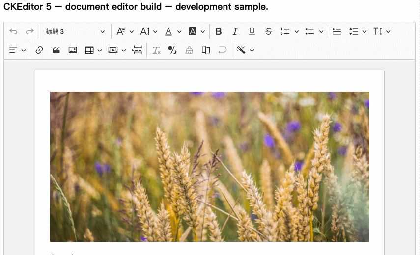

# CKEditor5-build-full
========================================


[](https://www.npmjs.com/package/@ckeditor/ckeditor5-build-classic)
[](https://david-dm.org/letsbug/ckeditor5-build-full)
[](https://david-dm.org/letsbug/ckeditor5-build-full?type=dev)

 CKEditor5  [build overview](https://ckeditor.com/docs/ckeditor5/latest/builds/guides/overview.html)。



## Documentation

* [Installation](https://ckeditor.com/docs/ckeditor5/latest/builds/guides/integration/installation.html).
* [Basic API](https://ckeditor.com/docs/ckeditor5/latest/builds/guides/integration/basic-api.html).
* [Configuration](https://ckeditor.com/docs/ckeditor5/latest/builds/guides/integration/configuration.html).

## Quick start


```bash

npm i -S https://github.com/letsbug/ckeditor5-build-full.git

# or (if you have configured github's SSH key locally)
npm i -S git://git@github.com:letsbug/ckeditor5-build-full.git
```

cdn

```html
<div id="editor">
	<p>This is the editor content.</p>
</div>
<script src="./node_modules/@hlw/ckeditor5-build-full/build/ckeditor.js"></script>
<script>
	CKEDITOR.ClassicBuild
		.create( document.querySelector( '#editor' ) )
		.then( editor => {
			window.editor = editor;
		} )
		.catch( error => {
			console.error( 'There was a problem initializing the editor.', error );
		} );
</script>
```

webpack使用:

```js
import CKEditor from '@hlw/ckeditor5-build-full';

//  CommonJS:
// const CKEditor = require( '@ckeditor/ckeditor5-build-classic' );

CKEditor.ClassicBuild
	.create( document.querySelector( '#editor' ) )
	.then( editor => {
		window.editor = editor;
	} )
	.catch( error => {
		console.error( 'There was a problem initializing the editor.', error );
	} );
```

**Note:** ，(eg: `src/ckeditor.js`).： [Advanced setup guide](https://ckeditor.com/docs/ckeditor5/latest/builds/guides/integration/advanced-setup.html).

## License

Licensed under the terms of [GNU General Public License Version 2 or later](http://www.gnu.org/licenses/gpl.html). For full details about the license, please check the `LICENSE.md` file or [https://ckeditor.com/legal/ckeditor-oss-license](https://ckeditor.com/legal/ckeditor-oss-license).
